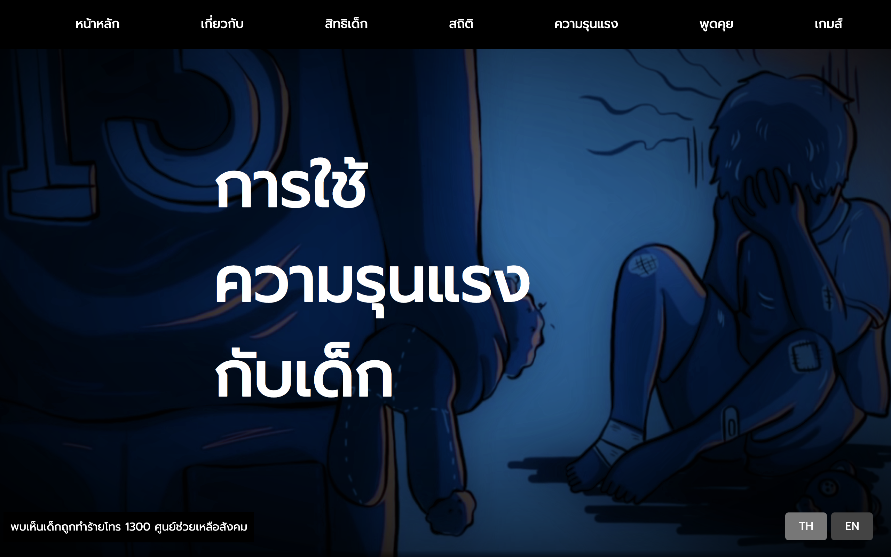
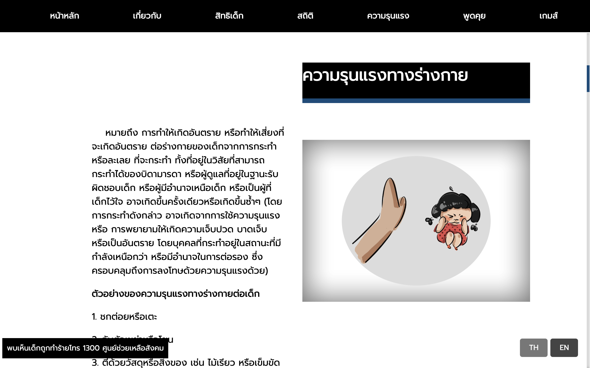
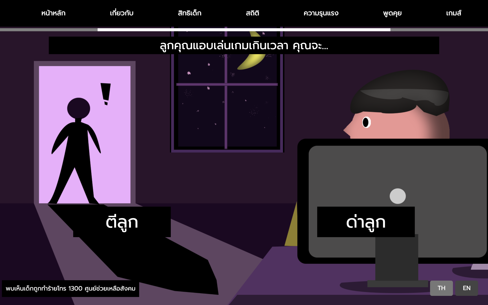
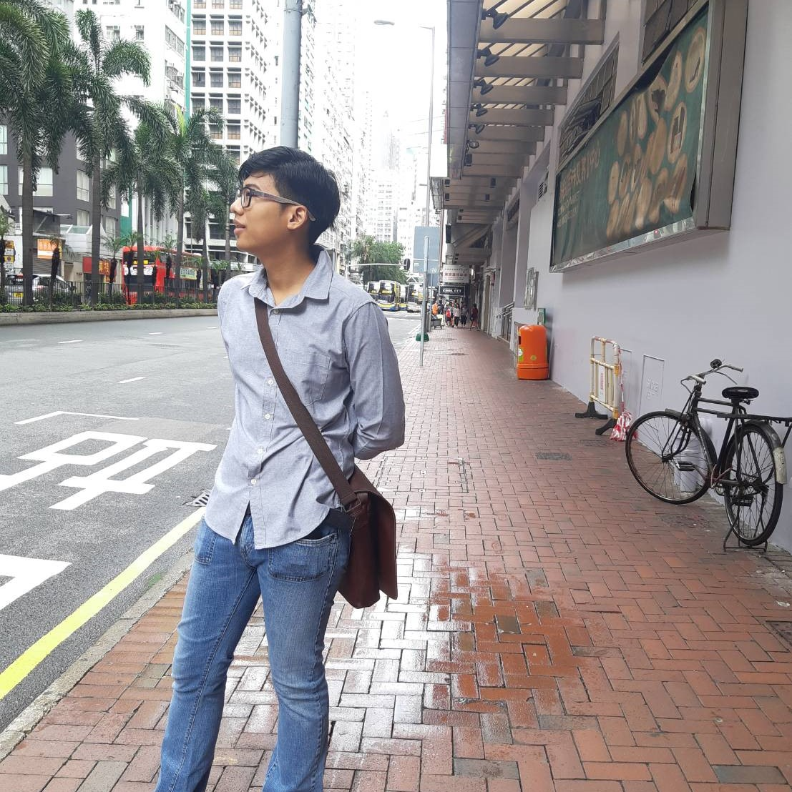
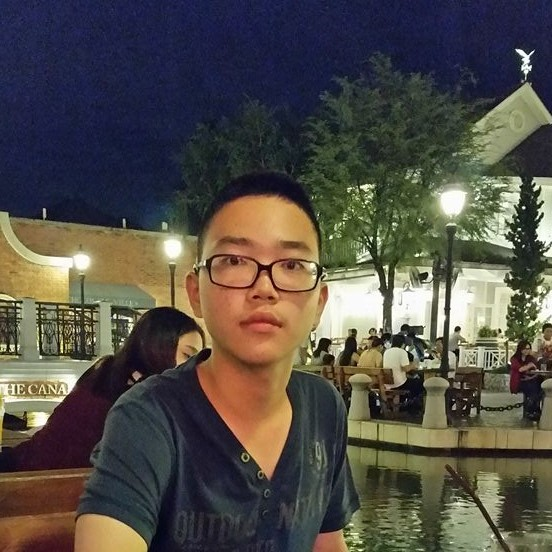

# PhysicalChildAbuse
Project : MULTIMEDIA TECHNOLOGY 2018 | PhysicalChildAbuse  
___

 &nbsp;&nbsp;&nbsp;&nbsp;&nbsp;&nbsp;เว็บนี้จัดทำขึ้นมาเพื่อสร้างความตื่นตัวในเรื่องสิทธิมนุษยชนที่มนุษย์ทุกคนพึงมี โดยเนื้อหาในเว็บจะมุ่งเน้นไปที่การใช้ความรุนแรงกับเด็กผ่านการลงโทษและสั่งสอนด้วยความรุนแรงทางกาย ซึ่งเป็นความเชื่อที่ผิดที่เกิดขึ้นในสังคมจากอดีตมาถึงปัจจุบัน นอกจากนี้ในเว็บยังประกอบไปด้วยวิธีการส่งเสริมการเลี้ยงลูกเชิงบวกที่ไม่จำเป็นต้องใช้ความรุนแรงในการเลี้ยงดูลูก
___
### เนื้อหา และ ข้อมูลภายในเว็บ

* การนำเสนอของเว็บจะอยู่ในรูปแบบ One-page และ เป็นเว็บ 2 ภาษา  
* ภายในเว็บจะนำเสนออนุสัญญาว่าด้วยสิทธิเด็ก และ จะกล่าวถึงปฏิญญสสากลว่าด้วยสิทธิมนุษยชน  
* นำเสนอส่วนของสถิติการใช้ความรุนแรงตั้งแต่ปี 2554-2558  
* เนื้อหาความรุนแรทางร่างกาย  
* ความเชื่อผิดๆ เกี่ยวกับการถูกลงโทษ  
* ข่าว และ วีดีโอเกี่ยวกับการทำร้ายร่างกายเด็ก 
* ทางเลือกในการลงโทษเด็ก ที่ไม่ใช่การทำร้ายร่างกาย    

___
 ### Game

&nbsp;&nbsp;&nbsp;&nbsp;&nbsp;&nbsp; ตัวเกมจะมี 2 ทางเลือก โดยตัวเลือกทั้งสองนั้น คือ การทำร้ายร่างกายเด็ก หากผู้เล่นไม่กดเลือกตัวเลือกทั้ง 2 ตัวเลือกนี้ เกมจะพาไปพบจุดจบที่ดีกว่า ซึ่งถือว่าเป็นการวัดใจผู้เล่นอีกด้วย แต่ถ้าหากกดเลือกตัวเลือกใดตัวเลือกหนึ่งไป เกมก็จะจบในหนทางที่ไม่ดีทั้ง 2 ทาง
___

### Team

|||||
|:-:|:-:|:-:|:-:|
|61070004|61070016|61070028|61070029|

|||||
|:-:|:-:|:-:|:-:|
|61070045|61070059|61070069|61070107|

